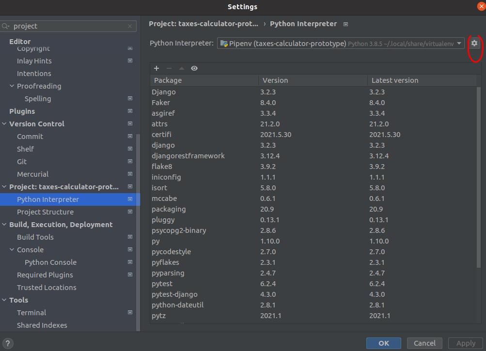
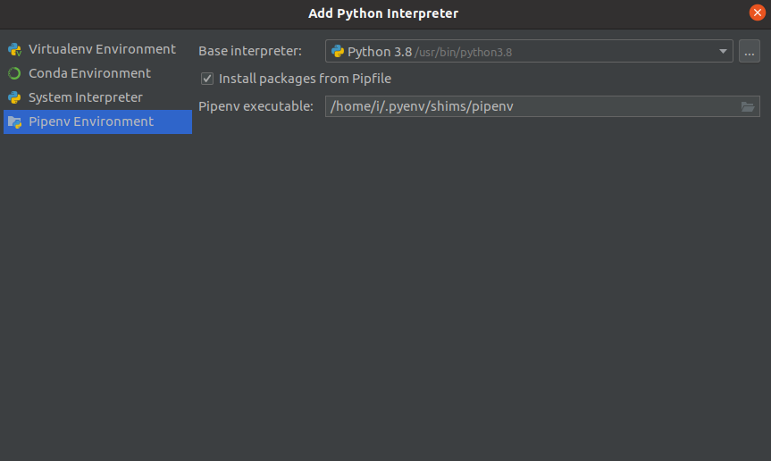
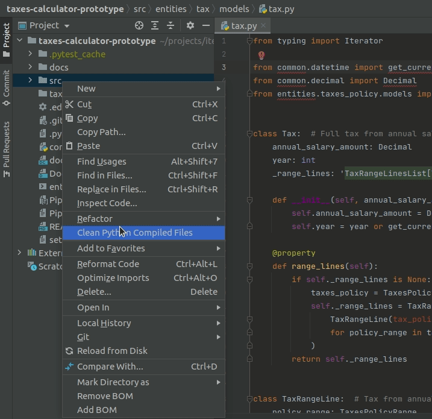
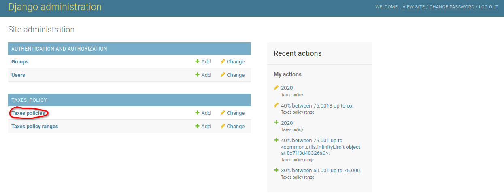
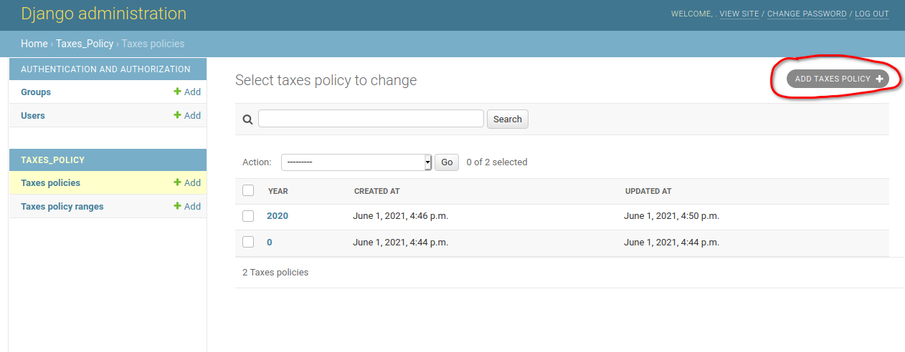
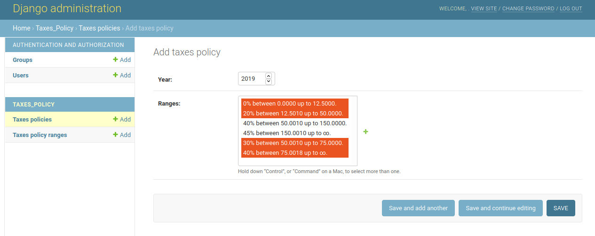
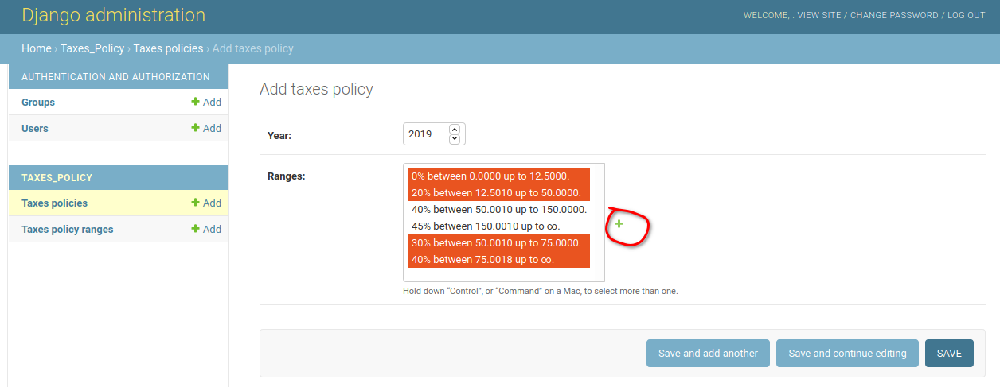
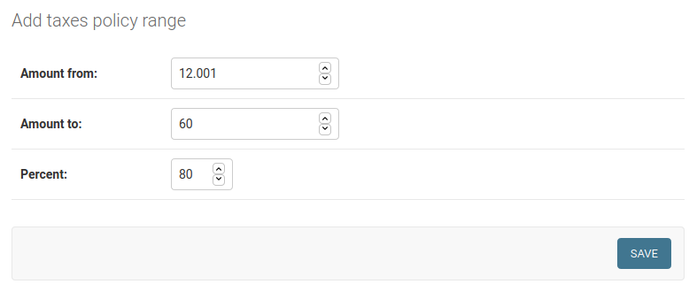
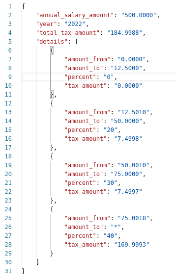

# Taxes calculator prototype

## How to run locally:
### 1. Using Docker-compose:
Create pg volume with:
>sudo docker volume create --name=taxes_calculator_prot_pg_data

Build and run:
>sudo docker-compose up

App should be running on <b>localhost:8008</b>. Check the status with:
>curl --location --request GET 'http://localhost:8008/health/'

### 2. Without docker-compose:
If you want to run tests (40 tests for such small app, I like tests) or run
isort and flake8 or maybe debug something:
1. Install python 3.8.2, for example with pyenv (https://github.com/pyenv/pyenv).
2. Install Pipenv:
    > sudo apt install pipenv
3. Activate virtual environment and install dependencies. In pycharm IDE: File->Settings:
   search for "python interpreter"
   
   choose "add" and select "Pipenv Environment" with Python 3.8 as base interpreter
    
4. Setup PostgreSQL and create database:
   >sudo apt update   
   >sudo apt install postgresql postgresql-contrib 
   >sudo -u postgres psql 
   >create user db_user with password 'db_password'; 
   >alter role db_user with createdb; 
   >create database taxes_calculator_db with owner db_user; 
   >\q 
5. Apply migrations from "/src":
   >python manage.py migrate
6. If you want to run app in Pycharm - mark "/src" directory as "sources root".
   
7. Set DEBUG_MODE=true in local environment.
8. Run app from "/src" with
   >python manage.py runserver
9. Run tests from "/src" with
    >pytest
10. Run isort from "/src" with
    >isort .
11. Run flake8 from "/src" with
    >flake8 .

## How to edit tax band data:

1. Go to http://localhost:8008/admin/, you need Taxes policies page

2. Then click "add taxes policy"

3. Enter a year and choose the ranges from existing

You can add new ranges by clicking "+"

4. Save your changes or additions.

## Taxes API

### /api/v1/taxes/
#### methods: PUT;
#### input data:
* annual_salary_amount: json integer, float or string;

example:
> {"annual_salary_amount": "500"}

#### GET-params:
* detailed - choices: "true", "false". If "true" - detailed response with all tax range lines
will be returned. Default value is "false".
* year - positive integer. The current year will be used by default. If there are no
existing taxes policy for requested year - taxes policy for the closest previous year will be used. If there is
no policies for previous years - defaults (for year 0) will be auto created.

#### curl example:
>curl --location --request PUT 'http://localhost:8008/api/v1/taxes/?detailed=true&year=2022' \
--header 'Content-Type: application/json' \
--data-raw '{
    "annual_salary_amount": "500"
}'
#### response example:

